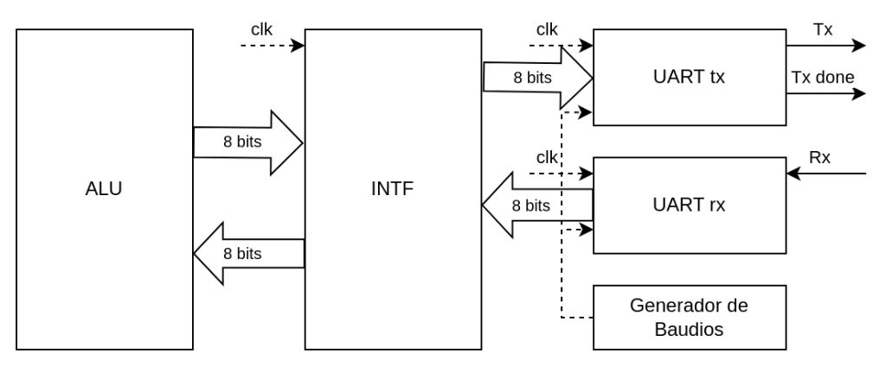
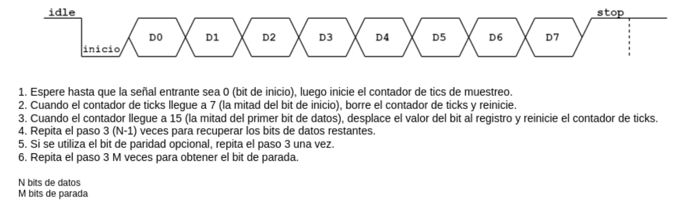
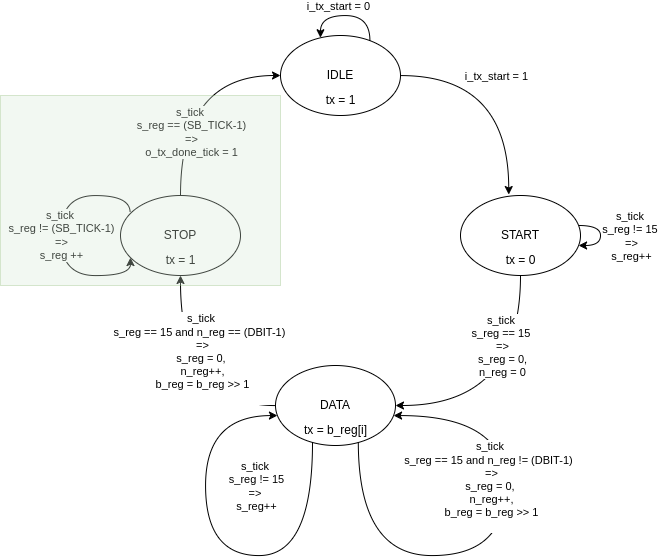
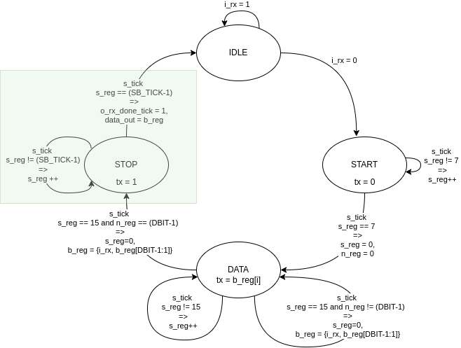
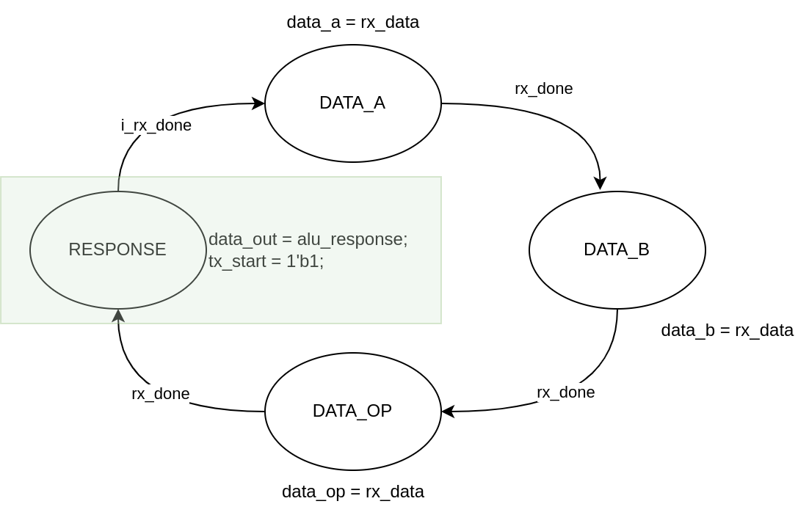
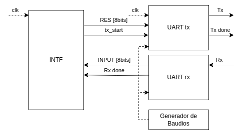
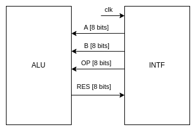

<p align="center">
  <br>
</p>

# Arquitectura de Computadoras 2024
## _TP#2 : Universal Asynchronous Receiver and Transmitter - UART_
@ Rodriguez Luciano Ariel

@ Hernando Agustin

## Enunciado
El objetivo de este trabajo es implementar en FPGA un módulo UART que se
comunique con el módulo ALU realizado en el trabajo práctico numero 1. Los requerimientos
del trabajo son los siguientes:

- El módulo UART y la interfaz deben ser diseñados como una máquina de estados (FSM).
- Implementar un modulo generador de baudios.
- Validar el desarrollo por medio de test bench.
- Simular el diseño usando las herramientas de simulación de vivado incluyendo análisis de tiempo.


## Arquitectura
<p align="center">
  <br><br>
  <em>Fig. Arquitectura</em>
</p>


## Implementacion física

<p align="center">
  <br><br>
  <em>Fig. Implementación</em>
</p>

## Desarrollo

### Módulo ALU
La Unidad Aritmética y Lógica (ALU) diseñada es de tipo combinacional y cuenta con de tres entradas parametrizables y una unica salida. Dos de las entradas son parametrizables y corresponden con los datos A y B, la tercer entrada es fija y se corresponde con el codigo de operación el cual es de un tamaño fijo de 6 bits.

| Operacion | Código    | 
|-----------|-----------|
| ADD       | 100000   | 
| SUB       | 100010   | 
| AND       | 100100   |
| OR        | 100101   |
| XOR       | 100110   |
| SRA       | 000011   |
| SRL       | 000010   |
| NOR       | 100111   |


### Módulo UART
El diseño del módulo UART se basa en el libro _‘FPGA Prototyping by Verilog examples’[1]_. Dicho diseño consta de cuatro módulos:
- Receptor (Uart Rx).
- Transmisor (Uart Tx).
- Generador de baudios.
- Interfaz. (Módulo Interfaz)

<p align="center">
  <br><br>
  <em>Fig. Funcionamiento de un módulo UART</em>
</p>


Este módulo es el componente de comunicación serial entre la FPGA y otro dispositivo que cuente con UART. El UART toma bytes de datos y transmite los bits individuales de forma secuencial. En el destino, un segundo UART reensambla los bits en bytes completos.

#### Generador de Baudios
Se implementó un generador de badios con los siguientes parametros `FREQ = 50Mhz`, `BAUD_RATE = 9600` y `SAMPLE_TIME = 16`, siendo estos los valores por defecto para frecuencia de reloj, tasa de transferencia y muestreo para el generador de baudios. El generador de baudios indicará por tanto los tick con los cuales luego funcionará el módulo UART.

```verilog
    localparam COUNTER = FREQ / (BAUD_RATE * SAMPLE_TIME);    // Cálculo del contador
    localparam N_BITS_COUNTER = $clog2(326);                  // Bits necesarios para el contador, $clog2() redondea hacia arriba

    reg [N_BITS_COUNTER-1:0] r_counter;                       // Registro para el contador

    always @(posedge i_clk or posedge i_reset) begin
        if (i_reset)
            r_counter <= COUNTER - 1;                         // Reinicia el contador en reset
        else if (r_counter == 0)
            r_counter <= COUNTER - 1;                         // Reinicia cuando llega a 0
        else
            r_counter <= r_counter - 1;                       // Decrementa el contador
    end

    assign o_tick = (r_counter == 0);
```
Se define COUNTER, que calcula el valor necesario para el contador en función de la frecuencia del reloj, la tasa de baudios y el muestreo. Con 9600 baudios y muestreo de 16, el contador es 326.

el registro `r_counter` se inicializa en COUNTER - 1. En cada ciclo de reloj, se decrementa hasta alcanzar 0. Cuando esto ocurre, se reinicia al valor de COUNTER - 1.

La señal `o_tick` se activa cuando el contador llega a 0


#### UART Tx Diseño (Transmisor)
El transmisor UART envía datos en serie y opera en diferentes estados controlados por una máquina de estados finitos (FSM) y sincronizados por el reloj y el tick del generador de baudios.

Parámetros:

- `DBIT = 8`: número de bits de datos.
- `SB_TICK = 16`: duración del bit de parada.

Estados:
<p align="center">
  <br><br>
  <em>Fig. Funcionamiento de un módulo UART</em>
</p>

- `IDLE`: Espera el inicio de transmisión (i_tx_start).
- `START`: Envía un bit de inicio (tx_next = 0) durante 16 ticks.
- `DATA`: Envía los bits de datos (DBIT) uno por uno, usando desplazamiento.
- `STOP`: Envía el bit de parada (tx_next = 1) durante 16 ticks, luego vuelve a IDLE y activa o_tx_done_tick para indicar fin de transmisión.


#### UART Rx Diseño (Receptor)
El receptor UART recibe datos en serie y opera con una FSM que detecta y almacena los bits de datos, también sincronizada con el tick de baudios y el reloj.

Parámetros:

- `DBIT = 8`: número de bits de datos.
- `SB_TICK = 16`: duración del bit de parada.

Estados:
<p align="center">
  <br><br>
  <em>Fig. Funcionamiento de un módulo UART</em>
</p>

- `IDLE`: Espera el bit de inicio (i_rx = 0).
- `START`: Verifica el bit de inicio a mitad del ciclo de reloj y cambia a DATA.
- `DATA`: Lee cada bit de datos y lo almacena en un registro (b_reg) con desplazamiento, repitiendo esto para DBIT bits.
- `STOP`: Espera el bit de parada. Tras 16 ticks, asigna los datos recibidos a la salida o_dout y activa o_rx_done_tick, indicando que el byte completo se ha recibido.

Resumen de Operación: Cada bit recibido es validado en intervalos específicos, asegurando que el módulo se mantenga sincronizado. La salida o_dout irá conectada hacia una interfaz la cual se encargará de almacenar los bits recibidos y o_rx_done_tick señala el final de la recepción.

### Módulo Interfaz

<p align="center">
  <br><br>
  <em>Fig. Máquina de estados</em>
</p>

#### Interfaz - UART
<p align="center">
  <br><br>
  <em>Fig. Implementación</em>
</p>

#### Interfaz - ALU
<p align="center">
  <br><br>
  <em>Fig. Implementación</em>
</p>

### TOP

### Constraint y configuración de la placa
### Pruebas
## Conclusión

## Referencias
[1] Pong P. Chu, FPGA Prototyping by Verilog Examples. Cleveland State University, 2008
