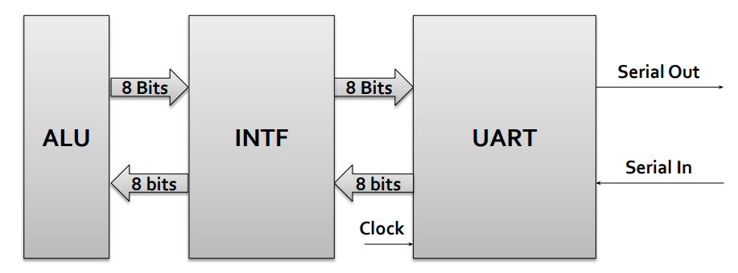

   

# Arquitectura de Computadoras 2024
## _TP#2 : Universal Asynchronous Receiver and Transmitter - UART_

   

@ Rodriguez Luciano Ariel

@ Hernando Agustin
## Enunciado

- Implementar en FPGA una UART. El módulo UART y la interfaz deben ser diseñados como una máquina de estados
(FSM).
- Implementar en FPGA una Interfaz para conectar el módulo UART con el módulo ALU.
- Implementar un modulo generador de baudios parametrizable.
- Validar el desarrollo por medio de Test Bench.
- Generar testbench.
- Simular el diseño usando las herramientas de simulación de vivado incluyendo análisis de tiempo.
- 

### Operaciones

| Operacion | Código    | 
|-----------|-----------|
| ADD       | 100000   | 
| SUB       | 100010   | 
| AND       | 100100   |
| OR        | 100101   |
| XOR       | 100110   |
| SRA       | 000011   |
| SRL       | 000010   |
| NOR       | 100111   |

    
  <em>Fig. Arquitectura</em>

## Desarrollo