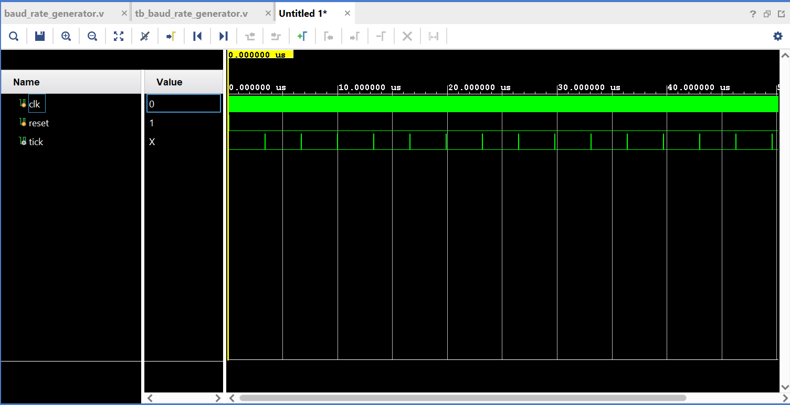
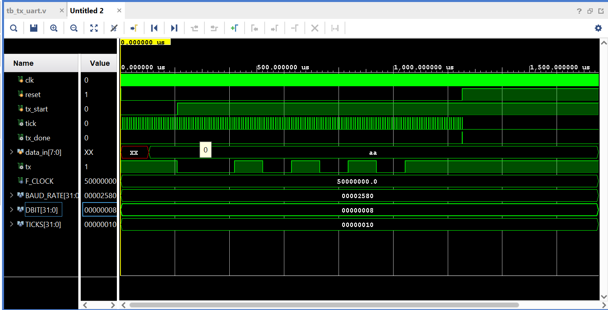

<p align="center">
  <br>
</p>

# Arquitectura de Computadoras 2024
## _TP#2 : Universal Asynchronous Receiver and Transmitter - UART_
@ Rodriguez Luciano Ariel

@ Hernando Agustin

## Enunciado
El objetivo de este trabajo es implementar en FPGA un módulo UART que se
comunique con el módulo ALU realizado en el trabajo práctico numero 1. Los requerimientos
del trabajo son los siguientes:

- El módulo UART y la interfaz deben ser diseñados como una máquina de estados (FSM).
- Implementar un modulo generador de baudios.
- Validar el desarrollo por medio de test bench.
- Simular el diseño usando las herramientas de simulación de vivado incluyendo análisis de tiempo.


## Arquitectura
<p align="center">
  <br><br>
  <em>Fig. Arquitectura</em>
</p>

## Desarrollo

### Módulo ALU
La Unidad Aritmética y Lógica (ALU) diseñada es de tipo combinacional y cuenta con de tres entradas parametrizables y una unica salida. Dos de las entradas son parametrizables y corresponden con los datos A y B, la tercer entrada es fija y se corresponde con el codigo de operación el cual es de un tamaño fijo de 6 bits.

| Operacion | Código    | 
|-----------|-----------|
| ADD       | 100000   | 
| SUB       | 100010   | 
| AND       | 100100   |
| OR        | 100101   |
| XOR       | 100110   |
| SRA       | 000011   |
| SRL       | 000010   |
| NOR       | 100111   |


### Módulo UART
El diseño del módulo UART se basa en el libro _‘FPGA Prototyping by Verilog examples’[1]_. Dicho diseño consta de cuatro módulos:
- Receptor (Uart Rx).
- Transmisor (Uart Tx).
- Generador de baudios.
- Interfaz. (Módulo Interfaz)

<p align="center">
  <br><br>
  <em>Fig. Funcionamiento de un módulo UART</em>
</p>


Este módulo es el componente de comunicación serial entre la FPGA y otro dispositivo que cuente con UART. El UART toma bytes de datos y transmite los bits individuales de forma secuencial. En el destino, un segundo UART reensambla los bits en bytes completos.

#### Generador de Baudios
Se implementó un generador de badios con los siguientes parametros `FREQ = 50Mhz`, `BAUD_RATE = 9600` y `SAMPLE_TIME = 16`, siendo estos los valores por defecto para frecuencia de reloj, tasa de transferencia y muestreo para el generador de baudios. El generador de baudios indicará por tanto los tick con los cuales luego funcionará el módulo UART.

```verilog
    localparam COUNTER = FREQ / (BAUD_RATE * SAMPLE_TIME);    // Cálculo del contador
    localparam N_BITS_COUNTER = $clog2(326);                  // Bits necesarios para el contador, $clog2() redondea hacia arriba

    reg [N_BITS_COUNTER-1:0] r_counter;                       // Registro para el contador

    always @(posedge i_clk or posedge i_reset) begin
        if (i_reset)
            r_counter <= COUNTER - 1;                         // Reinicia el contador en reset
        else if (r_counter == 0)
            r_counter <= COUNTER - 1;                         // Reinicia cuando llega a 0
        else
            r_counter <= r_counter - 1;                       // Decrementa el contador
    end

    assign o_tick = (r_counter == 0);
```
Se define COUNTER, que calcula el valor necesario para el contador en función de la frecuencia del reloj, la tasa de baudios y el muestreo. Con 9600 baudios y muestreo de 16, el contador es 326.

el registro `r_counter` se inicializa en COUNTER - 1. En cada ciclo de reloj, se decrementa hasta alcanzar 0. Cuando esto ocurre, se reinicia al valor de COUNTER - 1.

La señal `o_tick` se activa cuando el contador llega a 0


#### UART Tx Diseño (Transmisor)
El transmisor UART envía datos en serie y opera en diferentes estados controlados por una máquina de estados finitos (FSM) y sincronizados por el reloj y el tick del generador de baudios.

Parámetros:

- `DBIT = 8`: número de bits de datos.
- `SB_TICK = 16`: duración del bit de parada.

Estados:
<p align="center">
  <br><br>
  <em>Fig. Funcionamiento de un módulo UART</em>
</p>

- `IDLE`: Espera el inicio de transmisión (i_tx_start).
- `START`: Envía un bit de inicio (tx_next = 0) durante 16 ticks.
- `DATA`: Envía los bits de datos (DBIT) uno por uno, usando desplazamiento.
- `STOP`: Envía el bit de parada (tx_next = 1) durante 16 ticks, luego vuelve a IDLE y activa o_tx_done_tick para indicar fin de transmisión.


#### UART Rx Diseño (Receptor)
El receptor UART recibe datos en serie y opera con una FSM que detecta y almacena los bits de datos, también sincronizada con el tick de baudios y el reloj.

Parámetros:

- `DBIT = 8`: número de bits de datos.
- `SB_TICK = 16`: duración del bit de parada.

Estados:
<p align="center">
  <br><br>
  <em>Fig. Funcionamiento de un módulo UART</em>
</p>

- `IDLE`: Espera el bit de inicio (i_rx = 0).
- `START`: Verifica el bit de inicio a mitad del ciclo de reloj y cambia a DATA.
- `DATA`: Lee cada bit de datos y lo almacena en un registro (b_reg) con desplazamiento, repitiendo esto para DBIT bits.
- `STOP`: Espera el bit de parada. Tras 16 ticks, asigna los datos recibidos a la salida o_dout y activa o_rx_done_tick, indicando que el byte completo se ha recibido.

Resumen de Operación: Cada bit recibido es validado en intervalos específicos, asegurando que el módulo se mantenga sincronizado. La salida o_dout irá conectada hacia una interfaz la cual se encargará de almacenar los bits recibidos y o_rx_done_tick señala el final de la recepción.

### Módulo Interfaz

<p align="center">
  <br><br>
  <em>Fig. Máquina de estados</em>
</p>

```verilog
module interface#(
    parameter DBIT = 8,                 // Data bits
    parameter NB_OP = 6                 // Operation bits
)(
    input wire i_clk, i_reset,          // Input clock y reset
    input wire i_rx_done,               //  este es el done del receptor del modulo uart
    input [DBIT-1:0] i_rx_data,         // este es el dato que sale del receptor del modulo uart
    input [DBIT-1:0] i_alu_data,        // esta es la entrada de datos del modulo alu


    //datos para la alu
    output  [DBIT-1:0] o_data_a,        //dato A
    output  [DBIT-1:0] o_data_b,        //dato B
    output  [NB_OP-1:0] o_data_op,      //operacion

    // datos de la interfaz a enviar a tx del modulo uart
    output  o_tx_start,                 // start para conversion del modulo uart
    output [DBIT-1:0] o_dout            //dato de salida del resultado de la operacion
);
```

Este es el encabezado del módulo `interface`, que permite configurar el número de bits para los datos (`DBIT`) y para la operación (`NB_OP`). Este módulo actúa como una interfaz para recibir datos y comandos desde un receptor UART, procesarlos y luego enviar los resultados de la operación a un transmisor UART.

```verilog
// Parámetros de Estado
localparam  [1:0] DATA_A = 2'b00;       // estado para recibir dato A
localparam  [1:0] DATA_B = 2'b01;       // estado para recibir dato B
localparam  [1:0] DATA_OP = 2'b10;      // estado para recibir operacion
localparam  [1:0] RESPONSE = 2'b11;     // estado para enviar datos
```

Define los estados posibles para el módulo, que determinan si el módulo está esperando el dato A, dato B, la operación, o si está enviando el resultado de la operación.

```verilog
// Registros internos 
reg [1:0] state_reg, state_next;            // Registros de estado
reg [DBIT-1:0] data_a_reg, data_b_reg, data_a_next, data_b_next;// Registro de datos
reg [NB_OP-1:0] data_op_reg, data_op_next;  // Registro de operacion
reg [DBIT-1:0] data_out_reg, data_out_next; // Registro de salida de datos
reg tx_start_reg, tx_start_next;            // Registro de salida de datos
```

Define los registros internos para almacenar los datos de entrada, la operación, el resultado, y el estado de transmisión UART, tanto en el ciclo actual como en el próximo.
```verilog
// Bloque always Sincrónico
always @(posedge i_clk or posedge i_reset) begin
    if (i_reset) begin
        state_reg <= DATA_A;
        data_a_reg <= 0;
        data_b_reg <= 0;
        data_op_reg <= 0;
        data_out_reg <= 0;
        tx_start_reg <= 0;
    end
    else begin
        state_reg <= state_next;
        data_a_reg <= data_a_next;
        data_b_reg <= data_b_next;
        data_op_reg <= data_op_next;
        data_out_reg <= data_out_next;
        tx_start_reg <= tx_start_next;
    end
end
```

Inicializa los registros en cero cuando se activa el reset y actualiza el estado y los datos en cada ciclo de reloj.

```verilog
// Lógica Combinacional para la Máquina de Estados
always @(posedge i_clk or posedge i_reset) begin
    if (i_reset) begin
        state_reg <= DATA_A;
        data_a_reg <= 0;
        data_b_reg <= 0;
        data_op_reg <= 0;
        data_out_reg <= 0;
        tx_start_reg <= 0;
    end
    else begin
        state_reg <= state_next;
        data_a_reg <= data_a_next;
        data_b_reg <= data_b_next;
        data_op_reg <= data_op_next;
        data_out_reg <= data_out_next;
        tx_start_reg <= tx_start_next;
    end
end
```
Este bloque implementa la lógica de la máquina de estados. Según el estado actual (state_reg), realiza las siguientes operaciones:

- `DATA_A`: Espera a i_rx_done para recibir el dato A y luego pasa al estado DATA_B.
- `DATA_B`: Espera a i_rx_done para recibir el dato B y luego pasa al estado DATA_OP.
- `DATA_OP`: Espera a i_rx_done para recibir la operación y luego pasa al estado RESPONSE.
- `RESPONSE`: Asigna el dato de salida (i_alu_data) al registro de salida, inicia la transmisión (tx_start_next), y vuelve al estado DATA_A.


```verilog
// Salidas Asignadas
assign o_data_a = data_a_reg;
assign o_data_b = data_b_reg;
assign o_data_op = data_op_reg;
assign o_dout = data_out_reg;
assign o_tx_start = tx_start_reg;
```

Asigna los valores de los registros internos a las salidas del módulo.

#### Interfaz - UART
<p align="center">
  <br><br>
  <em>Fig. Detalles Interfaz - UART</em>
</p>

#### Interfaz - ALU
<p align="center">
  <br><br>
  <em>Fig. Detalles Interfaz - ALU</em>
</p>

### TOP
Es el módulo encargado de interconectar los diferentes submódulos para implementar el sistema de comunicación serie UART con una ALU controlada mediante una interfaz. Permite que los datos recibidos a través de UART se envíen a la ALU, donde se realiza una operación específica. Luego, el resultado se devuelve a través de UART, controlado por las señales generadas en la interfaz, la cual asegura mediante una maquina de estados que los datos se carguen por etapas.

Partes que conforman el TOP:
- Parametros: `DBIT`, `NB_OP`, `SB_TICK`, `FREQ`, `BAUD_RATE`, `SAMPLE_TIME`
- Entradas y Salidas:

```verilog
    input wire i_clk, i_reset,      // clock y reset
    input wire i_rx,                // Entrada externa de RX
    output wire o_tx,               // Salida externa de TX
    output wire o_tx_done           // Salida externa de TX-DONE
```
- Señales internas:  `alu_a`, `alu_b`, `alu_out`, `alu_op`, y `rx_done`.
- Instancia de `clk_wiz_0`.
```verilog
clk_wiz_0 instance_name
   (
    // Clock out ports
    .clk_out1(clk_w),               // output clk_out1
    // Status and control signals
    .reset(i_reset),                // input reset
    .locked(locked),                // output locked
   // Clock in ports
    .clk_in1(i_clk)                 // input clk_in1
);
```
Genera una señal de reloj `clk_w` partiendo de la señal de entrada i_clk.
- Instancia de los submodulos: `tx_uart`, `rx_uart`, `baud_rate_generator`, `interface`, `alu`
#### Clock wizard

<p align="center">
  <br><br>
  <em>Fig. Configuración clock wizard</em>
</p>

### Constraint y configuración de la placa

<p align="center">
  <br><br>
  <em>Fig. Nexys 4 DDR.</em>
</p>

<p align="center">
  <br><br>
  <em>Fig. Interfaz gráfica para transmitir los bits desde la PC a la placa</em>
</p>


```verilog
## Clock signal
set_property -dict { PACKAGE_PIN E3    IOSTANDARD LVCMOS33 } [get_ports { i_clk }]; #IO_L12P_T1_MRCC_35 Sch=clk100mhz
create_clock -add -name sys_clk_pin -period 10.00 -waveform {0 5} [get_ports {i_clk}];

## Reset
set_property -dict { PACKAGE_PIN M18   IOSTANDARD LVCMOS33 } [get_ports { i_reset }]; #IO_L4N_T0_D05_14 Sch=btnu
set_property -dict { PACKAGE_PIN C4    IOSTANDARD LVCMOS33 } [get_ports { i_rx }]; #IO_L7P_T1_AD6P_35 Sch=uart_txd_in
set_property -dict { PACKAGE_PIN D4    IOSTANDARD LVCMOS33 } [get_ports { o_tx }]; #IO_L11N_T1_SRCC_35 Sch=uart_rxd_out

set_property -dict { PACKAGE_PIN H17   IOSTANDARD LVCMOS33 } [get_ports {o_tx_done }]; #IO_L18P_T2_A24_15 Sch=led[0]

```
### Pruebas y Test benchs

<p align="center">
  <br><br>
  <em>Fig. TB Generador de Baudios</em>
</p>
<p align="center">
  <br><br>
  <em>Fig. TB Interfaz</em>
</p>
<p align="center">
  <br><br>
  <em>Fig. TB UART Rx</em>
</p>
<p align="center">
  <br><br>
  <em>Fig. TB UART TX</em>
</p>
<p align="center">
  <br><br>
  <em>Fig. TB TOP</em>
</p>

## Conclusión
Durante el desarrollo del trabajo práctico, se logró implementar y poner en funcionamiento un sistema de comunicación UART, uno de los protocolos más comunes y ampliamente utilizados en la industria tecnológica. Este sistema fue integrado para enviar información de entrada al módulo ALU desarrollado previamente, permitiendo a la ALU recibir parámetros de entrada y códigos de operación y generando un resultado el cual es visualizado en nuestra interfaz gráfica programada en Python.

A lo largo de este proceso, aprendimos sobre el funcionamiento de una máquina de estados, en la cual se gestionaron y controlaron múltiples operaciones mediante el uso de variables y registros secundarios. Este enfoque facilitó la sincronización y gestión de las señales involucradas en la transmisión y recepción de datos, además de asegurar el correcto flujo de información entre los módulos.

Asimismo, este proyecto brindó una experiencia práctica en la integración de componentes digitales a nivel de hardware, desarrollando habilidades en diseño modular y control de flujo mediante máquinas de estados. Esto, además de mejorar nuestra comprensión sobre comunicación serial, nos permitió afianzar conceptos fundamentales en diseño digital y programación de sistemas embebidos, habilidades esenciales para abordar futuros proyectos de sistemas complejos.

## Referencias
[1] Pong P. Chu, FPGA Prototyping by Verilog Examples. Cleveland State University, 2008
